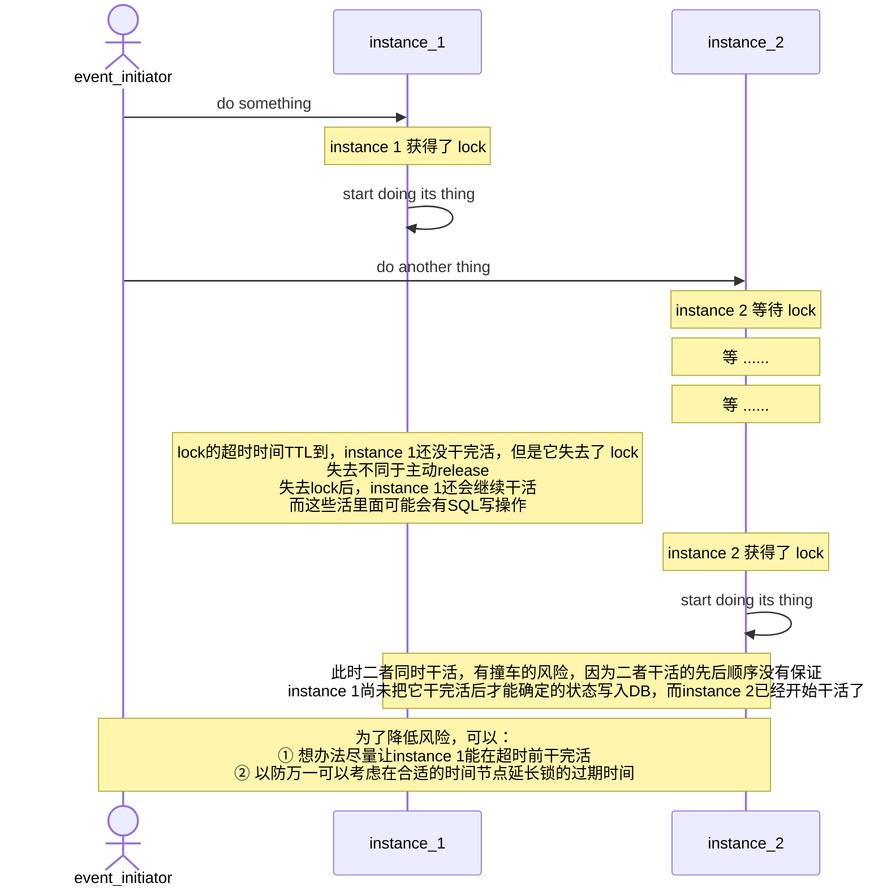
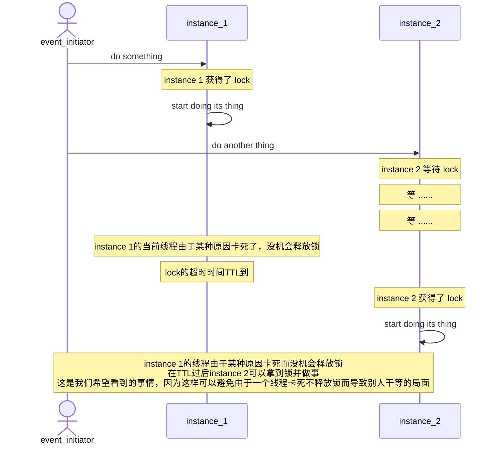
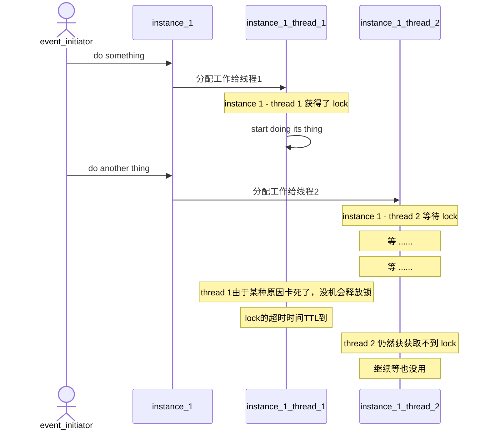
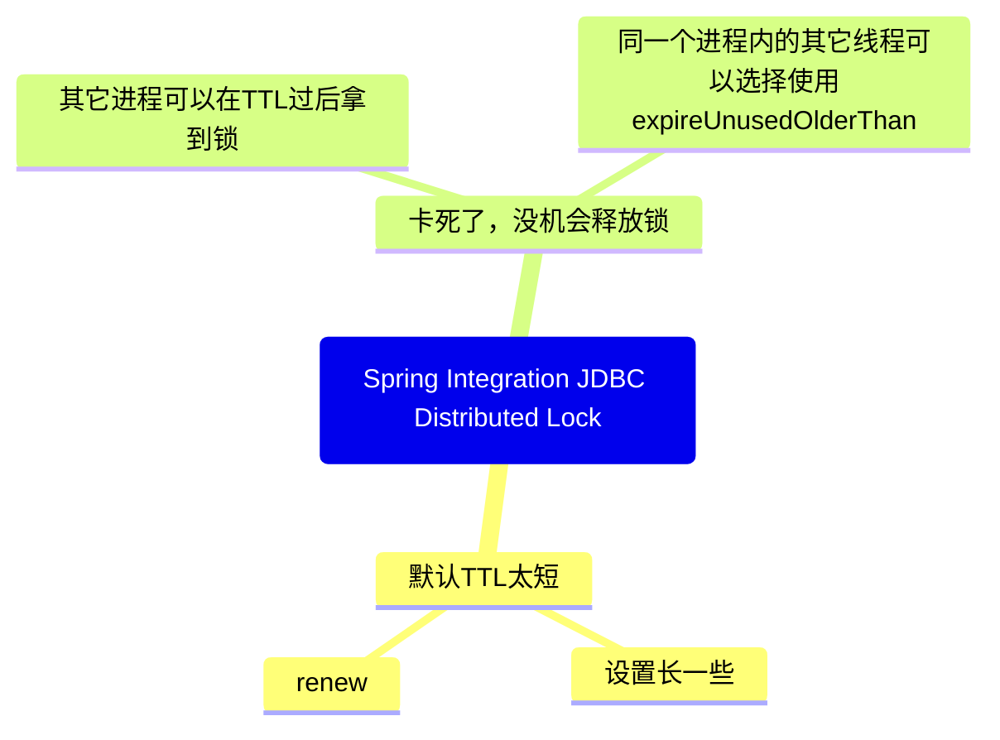

最近在项目中需要使用Spring Integration提供的基于JDBC实现的分布式锁。

在实践的过程中，我们遇到了一些有趣的问题，现在在此记录和总结一下。

一共遇到了两个问题，第一个和time to live有关，第二个还是和time to live有关。

# 第一个问题：由于time to live默认值不够长而导致被动失去锁的问题



根据上图所示，我们有两个实例。

事件的触发者首先让第一个实例去处理一个事件。第一个实例获取了一个锁并开始执行相应的任务。

此时，事件的触发者又让第二个实例去处理另一个事件。第二个实例也想获取同一个锁，但由于第一个实例已经开始处理了，第二个实例无法获取锁，只能等待。

在理想情况下，第一个实例会在完成任务后释放锁，然后第二个实例就可以获取锁并开始执行相应的任务，这样就不会有任何问题。

但是，如果由于某种原因第一个实例处理任务的速度太慢，就会出现问题。

因为Spring Integration JDBC分布式锁会遵循Time to Live的参数，该参数确定了在获取锁后最长可持有锁的时间。

如果超出了这个时间，而另一个人想要获取该锁，则可以获取到锁。**这是为了避免锁的持有者挂掉而导致其他人全部干等的防死锁机制。**

在这种情况下，就会有两个人同时运行。

我们本意是让锁保护资源以避免同时访问，但在这种情况下，资源会被同时访问。

如果这些访问中涉及到读取共享状态以决定后续行为以及写入其他人可能会读取的状态的操作，那么就会出现混乱。

在这种情况下，我们可以选择进行两个操作。

## 给time to live一个合理的值

实际上，相当于需要对运行时间进行合理的估算，然后尽量将time to live设置为能够覆盖该估算值的数值。

把这个估算出来的数字赋值给default lock repository的time to live就好了。

```java    
	/**
	 * Specify the time (in milliseconds) to expire deadlocks.
	 * @param timeToLive the time to expire deadlocks.
	 */
	public void setTimeToLive(int timeToLive) {
		this.ttl = Duration.ofMillis(timeToLive);
	}
```

[DefaultLockRepository](https://github.com/spring-projects/spring-integration/blob/7dcc0bb125eb5d72d9dc6cec0cc91bd4114336be/spring-integration-jdbc/src/main/java/org/springframework/integration/jdbc/lock/DefaultLockRepository.java#L190-L196)

## 选择在合适的时机renew

即使我们进行了合理的估算，但这只是一个估计值，不是绝对精确的值。

换言之，在某些情况下，运行时间仍可能延续到time to live过期之后，从而面临两个人同时访问的风险。

为了避免这种情况，可以在适当的时候进行renew操作。

例如，在执行耗时较长的操作之前调用lock registry的renewLock方法，这样就相当于在执行耗时较长的操作之前重新获取了一次锁。

```java
public interface RenewableLockRegistry extends LockRegistry {

	/**
	 * Renew the time to live of the lock is associated with the parameter object.
	 * The lock must be held by the current thread
	 * @param lockKey The object with which the lock is associated.
	 */
	void renewLock(Object lockKey);
}
```
[RenewableLockRegistry](https://github.com/spring-projects/spring-integration/blob/7dcc0bb125eb5d72d9dc6cec0cc91bd4114336be/spring-integration-core/src/main/java/org/springframework/integration/support/locks/RenewableLockRegistry.java#L28-L37)

# 第二个问题：time to live对于运行在同一个进程中的两个线程来说是不会自动生效的



在上述图中，我们描述了两个实例，即在不同机器（或容器）上运行的两个不同Java进程。这是跨进程协作的情况，这正是我们需要**分布式**锁的主要原因。

在这种场景下，time to live是有效的。它可以防止一个进程无法释放锁，从而导致其他进程一直等待锁而无法继续工作的局面的出现。

在跨进程协作中，time to live可以发挥作用，那对于同一个进程中的两个线程，**是否同样有效呢？**

从概念上来说，如果能将其设计成同样有效的，则可以减轻使用者的认知负担。

但是，在Spring Integration JDBC的分布式锁实现中，time to live**并不是这样的。它对于同一个Java进程中的两个线程来说是不会自动生效的。**

下面的图是一个它不会生效的具体例子。 



正如上图所示，第二个线程或同一个进程中的任何其他线程，即使继续等待锁，也无济于事。这也解释了time to live在这种情况下的无效性。

[这份代码可以重现上面两幅图所描述的场景](https://github.com/cuipengfei/Spikes/blob/master/jpa/spring-jdbc-distributed-lock-issue/src/test/java/com/github/spring/example/LockTest.java)

要解决这种情况下的问题，则需要用到下面提到的这个expireUnusedOlderThan方法。

```java
public interface ExpirableLockRegistry extends LockRegistry {

	/**
	 * Remove locks last acquired more than 'age' ago that are not currently locked.
	 * @param age the time since the lock was last obtained.
	 * @throws IllegalStateException if the registry configuration does not support this feature.
	 */
	void expireUnusedOlderThan(long age);

}
```

[ExpirableLockRegistry ](https://github.com/spring-projects/spring-integration/blob/7dcc0bb125eb5d72d9dc6cec0cc91bd4114336be/spring-integration-core/src/main/java/org/springframework/integration/support/locks/ExpirableLockRegistry.java#L27-L36)

如果一个Java进程中的一个线程因为某种原因卡死了，从而无法释放锁。
在TTL过期之后，另一个线程在尝试获取同一个锁之前，可以调用expireUnusedOlderThan来强制释放该锁。
然后再尝试获取锁，就可以成功获取并继续工作。

## 为什么不把time to leave设计的更具有概念上的一致性？

当涉及到跨越两个进程时，time to live会发挥作用。但是对于同一个进程中的两个线程来说，time to live就不再有效。这种同一个概念在不同的场景下表现出不同的行为，缺乏概念上的一致性，这可能会增加使用者的认知负担。

那Spring为什么要把它设计成这样呢？

以下是我的**解读**：

在分布式系统中，如果两个进程想要获得同一个锁，那么来得晚一些的进程实际上并不知道前一个进程目前处于什么状态，它是否已经死亡。在这种情况下，time to live成为了**决策的唯一依据**。如果time to live还没有过期，那么来得晚的进程认为它不应该获取该锁。一旦time to live过期，后续进程将把锁置于自己的控制之下，而不管前一个进程是否仍然活着。简而言之，由于**缺少其他的决策依据**，这种情况下只能选择依照time to live来简单粗暴的办事。

然而，对于同一个进程中的两个线程来说，情况就不同了。它们共享同一块内存空间(从实现层面来讲，同一个进程中的两个线程是共享**同一份registry和repository**的)。如果后续线程发现前一个线程在TTL过后还没有释放锁，则默认认为前一个线程仍然有继续工作的能力，因此它默认不会强制抢占锁。除非他在TTL之后等过一段时间之后觉得等不及了，这时候他**可以选择**强制把锁抢过来。

举个例子，就像在古代**缺乏无线电通信**的战争中。一支小队去执行任务，另一支小队待命。三个小时后，不论先前的小队是否成功，后续小队都必须出发参加战斗。因为除了这三个小时之外，你没有其他的决策依据。只要时间到了，我就开始行动。

但是，如果是同一支小队中的两个士兵，后面的士兵实际上可以在目视距离内看到前面的士兵是否仍然在执行任务。因此，**即便是战友行动太慢**了，他也可以选择多等待一会，让前面的士兵可以继续完成任务。当然，如果后面的士兵等不及了，想要立即行动，他也可以选择这样做。在这种情况下，后面的士兵**具有更多的决策依据**，因此他可以选择多等待一段时间或立即采取行动。

# 总结

第一个问题：由于time to live默认值不够长，而导致在还不该失去锁的时间点上过早地失去了锁（**防死锁机制过早地介入了**），解决方法是把TTL设置的足够大，以及在合适的时机做renew从而避免过早地失去锁。

第二个问题：time to live对于运行在同一个进程中的两个线程来说是**不会默认生效**的，从而导致应该失去锁的时间已经过了，但卡住的线程还没有释放锁，进而导致后续的线程拿不到锁的情况。解决方法是**可以选择**让同一个进程内的后来者线程使用expireUnusedOlderThan来强制剥夺锁(同一个进程中的两个线程，其中后来的那个具有更高的自由裁量权，不必只依据TTL一个指标来行事)。



锁的事，该失去就失去，不失去也强制失去。

锁的事，不该失去就不能失去，要失去也不许失去。

