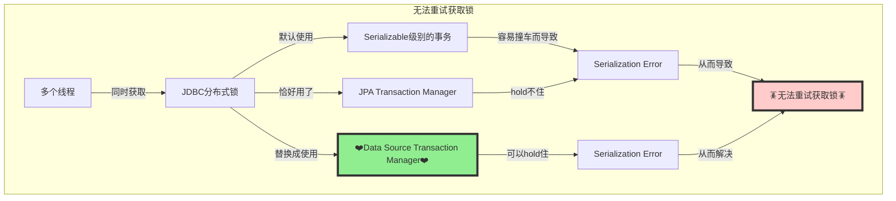

# 第一个问题：在多个线程中运行隔离级别为serializable的事务

Spring Integration JDBC分布式锁的实现会需要使用一个serializable级别的事务来**获取锁**。

如果多个线程同时尝试获取锁，这些事务之间可能会出现顺序问题。

具体而言，可能会遇到以下错误：

```
org.postgresql.util.PSQLException: ERROR: could not serialize access due to read/write dependencies among transactions
```

发生这样的问题其实也不可怕，因为JDBC锁会进行重试。

然而，当使用JPA Transaction Manager时，由于某些异常类型的原因，JDBC锁无法在发生这种错误的情况下进行重试。

可以在以下GitHub Issue中查看详细信息：
https://github.com/spring-projects/spring-integration/issues/3733

可以使用以下代码重现此问题：
https://github.com/cuipengfei/Spikes/blob/master/jpa/lock-transaction-threads/src/main/java/com/github/spring/example/service/Problem1Service.java

# 使用Data Source Transaction Manager来workaround第一个问题

可以明确指定让JDBC锁不使用JPA Transaction Manager，而是使用Data Source Transaction Manager来绕过此问题。

具体代码请参考：
https://github.com/cuipengfei/Spikes/blob/master/jpa/lock-transaction-threads/src/main/java/com/github/spring/example/configs/CustomJDBCLockConfigs.java

可以执行该代码以观察workaround的效果：
https://github.com/cuipengfei/Spikes/blob/master/jpa/lock-transaction-threads/src/main/java/com/github/spring/example/service/Problem1FixService.java

# 第二个问题：在同一个线程中先使用JPA启动一个事务，然后尝试获取JDBC锁所导致的事务隔离级别变化的问题

该问题的显著特征是：如果在一个方法上标注了@Transactional，然后在该方法内部先执行了一些JPA的SQL操作，然后再尝试获取JDBC分布式锁，就会出现无法更改事务隔离级别的问题。

问题的关键在于并行流（parallel stream）并不总是仅利用其自己线程池中的线程，它也会利用当前线程。
而恰好落在当前线程上的那一次尝试获取JDBC分布式锁的操作就会出现无法更改事务隔离级别的问题。

可以通过以下代码观察parallel stream的行为：
https://github.com/cuipengfei/Spikes/blob/master/jpa/lock-transaction-threads/src/main/java/com/github/spring/example/TestParallelStreamThreads.java

可以使用以下代码重现该问题：
https://github.com/cuipengfei/Spikes/blob/master/jpa/lock-transaction-threads/src/main/java/com/github/spring/example/service/Problem2Service.java

# 第二个问题的不完善解决方法：强制parallel stream不使用当前线程

在解决该问题的过程中，我尝试了一种不太明智的方法，在这里也记录一下。

我最初的想法是，既然parallel stream会利用当前线程，从而导致落在当前线程上的那一次获取锁的操作失败，那么我干脆强制它不要使用当前线程。然而，这是一种非常简单粗暴的做法。

尽管这样做可以成功获取JDBC锁，但它也会导致一部分SQL游离在事务之外执行。
不仅仅是这个解决方法，**上述的三份代码也都会有这个问题**。

不太理想的解决方法的代码如下：
https://github.com/cuipengfei/Spikes/blob/master/jpa/lock-transaction-threads/src/main/java/com/github/spring/example/service/Problem2BadFixService.java

# 第二个问题的较优解决方法：缩小事务范围，避免将业务操作和获取JDBC锁的操作混合在同一个被@Transactional标注的方法内

**上述四份代码都存在一个共同的缺点**，即@Transactional注解的范围太广。

这容易导致JPA Transaction Manager范畴内与业务相关的SQL操作以及获取JDBC分布式锁的Data Source Transaction Manager范畴内的SQL操作混在一起。
当这两者混在一起时，很容易出现问题。

第二个问题的较优解决方法的代码请参考：
https://github.com/cuipengfei/Spikes/blob/master/jpa/lock-transaction-threads/src/main/java/com/github/spring/example/service/Problem2GoodFixService.java

# 最后用图来总结一下



```mermaid
flowchart TD
    
    style nd fill:lightgreen,stroke:#333,stroke-width:4px
    style ile fill:#FFCCCB,stroke:#333,stroke-width:4px

    st[同一个线程中]
    t[事务]
    t2[事务]
    tm[一个范围很宽的标注了@Transactional的方法]
    js[JPA的SQL操作]
    tl[获取JDBC分布式锁]
    js2[JPA的SQL操作]
    tl2[获取JDBC分布式锁]
    ps[Parallel Stream]
    op[其自己线程池中的线程]
    ct[当前线程]
    ile[🪳无法更改事务隔离级别的问题🪳]
    nd[❤️正确做法应该是缩小@Transactional的范围❤️]

    subgraph 事务隔离级别变化的问题
    ps-->|并不总是仅利用|op
    ps-->|也会利用|ct
    ct-->|那么就会在|st
    st-->|跑|tm
    tm-->|先执行了一些|js
    tm-->|然后再尝试|tl
    js-->|已经open了|t
    tl-->|再去试图更改其隔离等级|t
    t-->|从而导致|ile

    nd-->|可以及时关闭|t2
    t2-->|避免把二者混在一起|js2
    t2-->|避免把二者混在一起|tl2
    js2-->|从而避免|ile
    tl2-->|从而避免|ile
    end
```