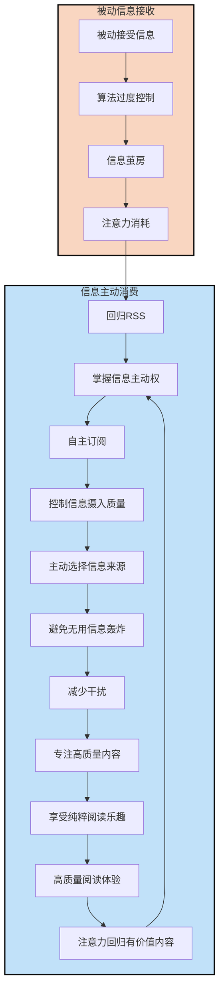

```mermaid
flowchart TD
  subgraph 被动信息接收
    style 被动信息接收 fill:#f9d6c1,stroke:#000,stroke-width:2px;
    A[被动接受信息] --> B[算法过度控制]
    B --> C[信息茧房]
    C --> D[注意力消耗]
  end

  subgraph 信息主动消费
    style 信息主动消费 fill:#c1e1f9,stroke:#000,stroke-width:2px;
    E[回归RSS] --> F[掌握信息主动权]
    F --> G[自主订阅]
    G --> H[控制信息摄入质量]
    H --> I[主动选择信息来源]
    I --> J[避免无用信息轰炸]
    J --> K[减少干扰]
    K --> L[专注高质量内容]
    L --> M[享受纯粹阅读乐趣]
    M --> N[高质量阅读体验]
    N --> O[注意力回归有价值内容]
    O --> F
  end

  D --> E
          
```