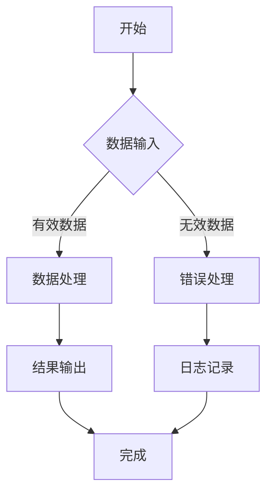
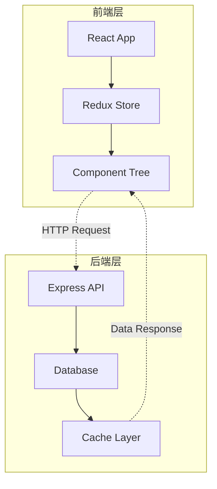
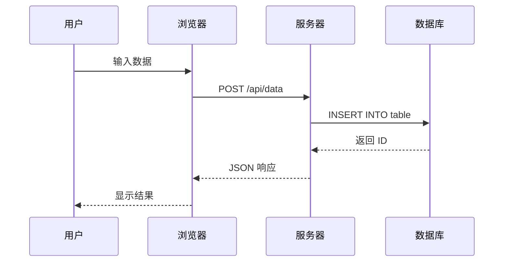

<!-- 
  纯 Markdown 演示文稿
  使用 Reveal.js 的高级功能，但内容完全用 Markdown 编写
  特效通过 Reveal.js 的注释语法实现
-->

## 🚀 Reveal.js 高级特效演示

### 极致的视觉体验

- 背景视频 · 动态效果 · 交互体验
- 使用纯 Markdown 语法编写
- 所有特效通过 Reveal.js 注释实现

---

## 🎨 背景特效展示

### 渐变背景效果

支持多种背景效果：

- 线性渐变
- 径向渐变  
- 图片背景
- 视频背景
- 纯色背景

### 图片背景 + 透明度

支持透明度调节的图片背景：

- 图片透明度
- 背景模糊
- 视觉效果

### 纯色背景

简洁的纯色背景设计：

- 蓝色主题
- 红色主题
- 绿色主题
- 橙色主题

---

## 💻 代码高亮演示

### 多语言代码展示

```javascript
function fibonacci(n) {
    if (n <= 1) return n;
    return fibonacci(n - 1) + fibonacci(n - 2);
}

// 优化版本
function fibonacciOptimized(n, memo = {}) {
    if (n in memo) return memo[n];
    if (n <= 1) return n;
    
    memo[n] = fibonacciOptimized(n - 1, memo) + 
               fibonacciOptimized(n - 2, memo);
    return memo[n];
}
```

### Python 代码示例

```python
class AdvancedCalculator:
    def __init__(self):
        self.history = []
    
    def calculate(self, operation, a, b):
        result = {
            '+': a + b,
            '-': a - b,
            '*': a * b,
            '/': a / b
        }.get(operation, "Invalid operation")
        
        self.history.append(f"{a} {operation} {b} = {result}")
        return result
    
    def get_history(self):
        return self.history
```

---

## 📊 图表与数据可视化

### Mermaid 图表支持



### 复杂流程图



### 序列图演示



---

## 🎬 动画效果演示

### 列表动画效果

1. 第一步 - 淡入上升效果
2. 第二步 - 淡入下降效果
3. 第三步 - 淡入左移效果
4. 第四步 - 淡入右移效果
5. 第五步 - 淡入效果

### 高级动画效果

**高亮效果**
- 红色高亮
- 蓝色高亮
- 绿色高亮

**特殊效果**
- 放大效果
- 缩小效果
- 删除线效果

### 堆叠动画

通过 fragment 实现内容堆叠显示：
- 第一层内容（淡入然后淡出）
- 第二层内容（同样淡入淡出）
- 第三层内容（最后显示）

---

## 🎯 交互式元素

### 点击触发动画

使用 fragment 索引控制动画顺序：
- 第一步（点击显示第一步）
- 第二步（点击显示第二步）
- 第三步（点击显示第三步）

### 自动动画演示

使用 `data-auto-animate` 实现元素自动过渡：
- 元素会自动过渡到下一个状态
- 新增的内容块

---

## 🎵 多媒体支持

### 视频嵌入

支持嵌入视频文件：
- HTML5 video 标签
- 多种格式支持
- 自定义控制界面

### 音频支持

支持嵌入音频文件：
- HTML5 audio 标签
- 自动播放控制
- 音量调节

### 外部内容嵌入

支持嵌入外部内容：
- YouTube 视频
- iframe 内容
- 外部网页

---

## 🎨 主题与样式

### 内置主题展示

- **Black** - 经典黑色主题
- **White** - 纯净白色主题
- **League** - 深灰色主题
- **Sky** - 天蓝色主题
- **Solarized** - 护眼主题

### 自定义样式

支持 CSS 自定义样式：
- 自定义渐变背景
- 半透明效果
- 动画效果

---

## 📊 数据可视化

### 表格样式

| 功能 | 支持程度 | 说明 |
|------|----------|------|
| Markdown | ✅ 完全支持 | 原生 Markdown 语法 |
| HTML | ✅ 完全支持 | HTML 标签支持 |
| LaTeX | ✅ 支持 | 数学公式渲染 |
| Mermaid | ✅ 支持 | 图表支持 |

### 数学公式

$$
E = mc^2
$$

$$
\int_{-\infty}^{\infty} e^{-x^2} dx = \sqrt{\pi}
$$

$$
\frac{d}{dx}\left( \int_{a}^{x} f(t) dt \right) = f(x)
$$

---

## 🎮 演示控制

### 快捷键指南

**基本控制**
- `空格` / `→` - 下一张
- `Shift` + `空格` / `←` - 上一张
- `F` - 全屏模式
- `ESC` - 退出概览

**高级功能**
- `S` - 演讲者视图
- `O` - 幻灯片概览
- `Alt` + `点击` - 缩放
- `Ctrl` + `Shift` + `F` - 搜索

### 演讲者视图

按 `S` 键打开演讲者视图，可以看到：
- 当前幻灯片
- 下一张幻灯片预览
- 演讲者备注
- 时间显示
- 幻灯片计时

---

## 🚀 高级特效

### 3D 转场效果

- 3D 凸面转场（使用 3D 效果的转场动画）
- 3D 凹面转场（另一种 3D 转场效果）
- 缩放转场（背景图片的缩放转场效果）

### 背景动画

- 背景转场效果
- 缩放动画
- 淡入淡出效果

---

## 🎯 实用功能

### 搜索功能

按 `Ctrl` + `Shift` + `F` 打开搜索框：
- 支持全文搜索
- 快速定位内容

### 缩放功能

按住 `Alt` 键并点击任意位置：
- 可以放大查看细节
- 再次点击恢复原大小

### 概览模式

按 `ESC` 键进入概览模式：
- 可以看到所有幻灯片的缩略图
- 点击任意幻灯片快速跳转

---

## 🎨 创意布局

### 网格布局

使用 CSS Grid 实现响应式布局：

**卡片 1** | **卡片 2** | **卡片 3**
----------|-----------|----------
渐变背景 | 另一种渐变 | 蓝色渐变
卡片布局 | 卡片布局 | 卡片布局

### 弹性布局

使用 Flexbox 实现自适应布局：

**左侧内容** | **右侧内容**
-------------|-------------
弹性布局 | 更宽的区域
自适应宽度 | 自适应宽度

---

## 🎪 特殊效果

### 打字机效果

```
这是模拟的打字机效果...
```

### 闪烁效果

使用 CSS 动画实现闪烁效果：
- 闪烁效果
- 使用 CSS 动画

### 旋转效果

使用 CSS 动画实现旋转效果：
- 旋转效果
- 持续旋转

---

## 🎯 交互演示

### 点击计数器

交互式计数器演示：
- 点击按钮增加计数
- 实时显示点击次数

### 颜色选择器

动态背景颜色切换：
- 选择不同的背景颜色
- 一键重置为默认颜色

---

## 🎨 CSS 动画展示

### 自定义动画

- **滑入效果** - 从左侧滑入
- **弹跳效果** - 持续弹跳
- **脉冲效果** - 缩放脉冲

---

## 🎯 响应式设计

### 适配各种设备

**桌面端** 💻
- 完整功能
- 键盘快捷键
- 鼠标交互

**移动端** 📱
- 触控优化
- 手势支持
- 响应式布局

**投影仪** 📟
- 高清显示
- 大字体支持
- 对比度优化

**打印** 🖨️
- PDF 导出
- 纸张优化
- 无背景打印

---

## 🎉 特效总结

### 展示的功能

**视觉效果**
- ✅ 背景视频/图片
- ✅ 渐变背景
- ✅ 动画效果
- ✅ 3D 转场

**交互功能**
- ✅ 点击动画
- ✅ 搜索缩放
- ✅ 概览模式
- ✅ 演讲者视图

**内容支持**
- ✅ 代码高亮
- ✅ 数学公式
- ✅ 图表支持
- ✅ 多媒体

**高级特性**
- ✅ 自定义动画
- ✅ 响应式设计
- ✅ 插件扩展
- ✅ 主题定制

---

## 🎊 感谢观看！

### Reveal.js 高级特效演示

- 体验网页演示的无限可能
- 使用 Markdown 创建专业演示文稿
- 纯文本编写，丰富效果呈现

🚀 现在开始使用