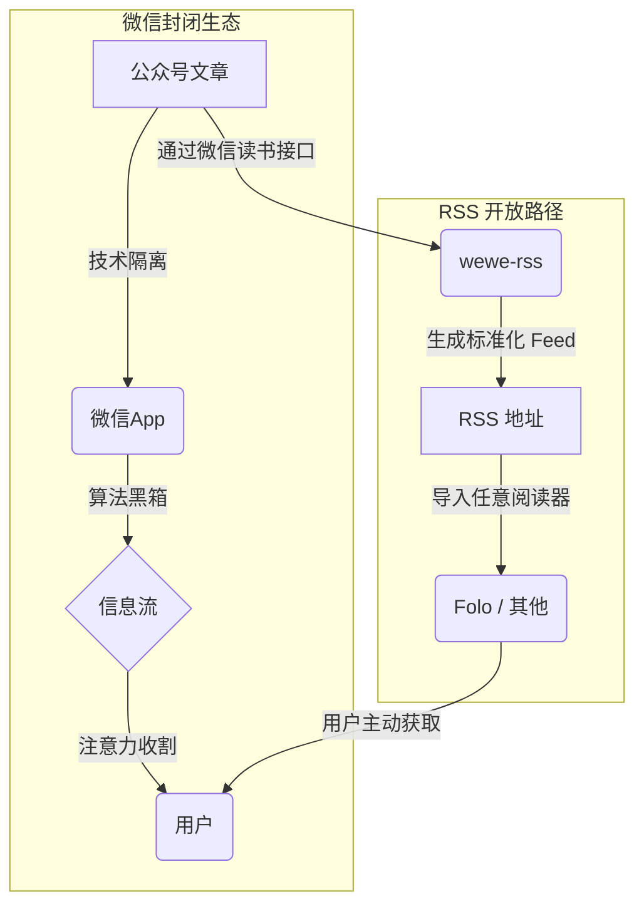

## 问题：信息获取的主动权是如何旁落的？

RSS，作为一种开放的信息订阅协议，其核心是用户掌握信息消费的主动权。内容按时间线呈现，简单、透明、可控。

微信公众号的出现，在繁荣内容生态的同时，也带来了信息消费模式的根本性转变：

- **开放 vs. 封闭**：RSS 是开放标准，公众号是封闭系统。
- **时序 vs. 算法**：RSS 是线性时间，公众号是算法黑箱。
- **主动 vs. 被动**：RSS 是用户决定看什么，公众号是算法在很大程度上决定用户看什么。

这个转变是渐进的，用户在不知不觉中，从信息的主动订阅者，转变成了算法的被动消费者。

.491kn3k47y.png>)

## 分析：微信公众号的封闭系统

要理解问题，就需要拆解这个系统。微信公众号通过两层“围墙”将用户和内容进行隔离。

### 第一层：技术隔离

公众号内容被限制在微信 App 内部，缺乏官方的开放接口（如 RSS 或 API）。这是一个典型的“围墙花园”策略，其目的是将用户流量和数据完全控制在自身生态内。

### 第二层：算法黑箱

即便用户关注了某个公众号，算法也在决定其信息流的呈现方式。它根据一套不透明的规则对内容进行排序和过滤，其核心目标是最大化平台的商业利益（如用户停留时长和广告转化率），而非用户的信息获取效率。用户的每一次交互，都在训练这个黑箱，使其更有效地“收割”注意力。

因此，所谓的“自主选择”，在这样一个被精心设计的系统里，很大程度上只是一种幻觉。

.60uji03h4a.png>)

## wewe-rss：在围墙上打个洞

直接对抗这个封闭系统是不现实的。`wewe-rss` 的思路体现了工程师的务实：不正面攻击，而是寻找系统的薄弱环节。

它利用了**微信读书**可以同步公众号文章的特性，通过调用微信读书的接口，将内容提取出来并转化为标准的 RSS 格式。

这个方案的巧妙之处在于：

- **接口来源**：使用了官方提供的功能接口，而非暴力抓取。
- **输出标准**：输出为通用 RSS 格式，解锁了阅读终端的选择。
- **稳定性**：相比直接抓取，依赖官方产品接口更为稳定。

但它依然是“次优”的，因为它存在明显的局限：更新有延迟、无法获取付费内容，并且其命脉掌握在微信读书的接口策略上。一旦接口关闭，通路即失效。

.5q7pouo8yv.png>)

## Folo：现代化的 RSS 阅读器

`wewe-rss` 解决了“源”的问题，但要获得完整的现代阅读体验，还需要一个优秀的“端”。`Folo` 填补了这个生态位。

`Folo` 不是一个简单的 RSS 阅读器，它在保留 RSS 核心精神（用户主导）的同时，融入了现代化的产品设计：

- **跨设备同步**：无缝同步阅读进度和收藏。
- **AI 辅助**：提供智能摘要和翻译，但把最终的判断权留给用户。
- **社区化发现**：通过用户创建的列表发现新的信息源。

将 `wewe-rss` 和 `Folo` 结合，我们能构建一个更符合个人需求的阅读流：

| 维度       | 微信公众号原生体验 | wewe-rss + Folo 方案 |
| :--------- | :----------------- | :------------------- |
| 阅读环境   | 干扰多，UI 复杂    | 专注阅读，界面纯净   |
| 内容排序   | 算法黑箱，不可控   | 时间顺序，完全透明   |
| 数据所有权 | 数据归平台所有     | 用户可导出，可迁移   |
| 开放性     | 封闭系统           | 基于开放标准，可组合 |

.7p3wf6trab.png>)

## 一个脆弱但有意义的方案

这套方案是完美的吗？坦率地说，不是。

它的有效性建立在对第三方非公开接口的依赖之上，这使其本身具有内在的脆弱性。但它的意义不在于提供了一个一劳永逸的“胜利”方案，而在于它代表了一种可能性。

它证明了，面对高度中心化的内容平台，用户并非完全无能为力。通过技术工具，个人可以在一定程度上绕开算法的黑箱，重新构建属于自己的信息网络，将选择权部分地收回自己手中。

RSS 这个看似古老的技术协议，在今天反而成为了对抗平台中心化最有效的工具之一。它提醒我们：开放协议的生命力，远比封闭花园的围墙更长久。

对于希望尝试这种方式的用户，可以参考以下步骤：

1.  **盘点信息源**：列出你真正需要关注的公众号。
2.  **获取 RSS 地址**：使用 `wewe-rss` 将它们转换为 RSS Feed。
3.  **选择阅读器**：将 Feed 地址添加到 `Folo` 或你喜欢的任何 RSS 阅读器。
4.  **养成习惯**：用主动的、定时的阅读，替代被动的、碎片化的浏览。

夺回信息选择权，不是一次性的技术部署，而是一种需要长期坚持的数字生活习惯。

