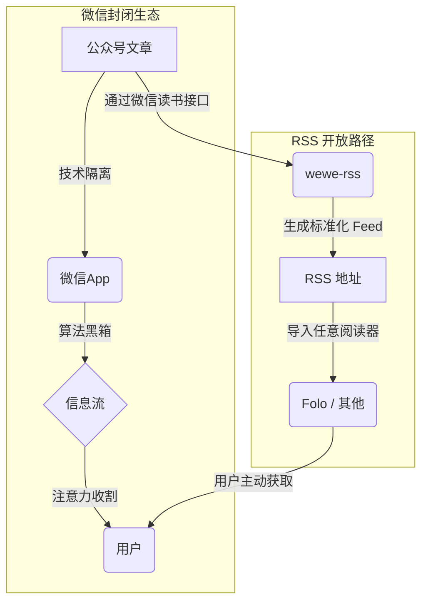

> "我们是怎么从信息的主人，变成了算法的奴隶？"

## 1. 问题：从主动订阅到被动投喂

RSS，那个曾经代表着互联网开放、互联精神的技术协议，正在被遗忘。十几年前，我们是信息的主人，主动订阅网站，信息按时间线呈现，简单、透明、可控。

然后，微信公众号出现了。它带来了内容生态的繁荣，也彻底改变了信息消费的方式：

- **开放 vs. 封闭**：RSS 是开放标准，公众号是封闭花园。
- **时序 vs. 算法**：RSS 是线性时间，公众号是算法黑箱。
- **主动 vs. 被动**：RSS 是我们决定看什么，公众号是算法决定给我们看什么。

这个转变如此顺滑，以至于我们几乎没有察觉。就像温水煮青蛙，当我们意识到信息选择权已经旁落时，我们早已习惯了被动投喂。

## 2. 分析：微信公众号的封闭系统是如何运作的

要理解问题，就需要拆解这个系统。微信公众号通过两层“围墙”将用户和内容牢牢锁定。

### 第一层围墙：技术隔离

公众号内容被锁在微信 App 内，没有提供任何官方的开放接口（如 RSS 或 API）。这意味着任何想消费其内容的用户，都必须接受它的平台规则和技术限制。这是一个典型的“围墙花园”策略，其商业目的是将用户流量和数据完全控制在自身生态内。

### 第二层围墙：算法黑箱

即便你关注了某个公众号，算法也在决定你“应该”看到什么。它根据一套不透明的规则对内容进行排序和过滤，其核心目标是最大化平台的商业利益（如用户停留时长和广告点击率），而非用户的信息获取效率。用户的每一次点击和滑动，都在无形中训练着这个黑箱，使其更有效率地“绑架”我们的注意力。

所谓的“自主选择”，在这样一个被精心设计的系统里，很大程度上只是一种幻觉。

## 3. wewe-rss 如何在围墙上打洞

直接对抗这个封闭系统是不现实的。`wewe-rss` 的思路体现了工程师的务实：不正面攻击，而是寻找系统的薄弱环节。

它利用了**微信读书**可以同步公众号文章的特性，通过调用微信读书的接口，将内容提取出来并转化为标准的 RSS 格式。

这个方案的巧妙之处在于：

- **合法性**：使用了官方提供的接口，风险较低。
- **稳定性**：相比直接抓取，依赖官方产品接口更为稳定。
- **标准化**：输出为通用 RSS 格式，解锁了阅读终端的选择。

但它依然是“次优”的，因为它存在明显的局限：更新有延迟、无法获取付费内容，并且命脉掌握在微信读书的接口策略上。一旦接口关闭，通路即失效。

## 4. Folo 如何让 RSS 重获新生

`wewe-rss` 解决了“源”的问题，但要获得完整的现代阅读体验，还需要一个优秀的“端”。`Folo` 填补了这个生态位。

`Folo` 不是一个简单的 RSS 阅读器，它在保留 RSS 核心精神（用户主导）的同时，融入了现代化的产品设计：

- **跨设备同步**：无缝同步阅读进度和收藏。
- **AI 辅助**：提供智能摘要和翻译，但把最终的判断权留给用户。
- **社区化发现**：通过用户创建的列表发现新的信息源。

将 `wewe-rss` 和 `Folo` 结合，我们能构建一个近乎完美的个人信息流：

| 维度       | 微信公众号原生体验 | wewe-rss + Folo 方案 |
| :--------- | :----------------- | :------------------- |
| 阅读环境   | 干扰多，UI 复杂    | 专注阅读，界面纯净   |
| 内容排序   | 算法黑箱，不可控   | 时间顺序，完全透明   |
| 数据所有权 | 数据归平台所有     | 用户可导出，可迁移   |
| 开放性     | 封闭系统           | 基于开放标准，可组合 |

## 5. 反思：这真的是一场胜利吗？

坦率地说，不是。

这套方案依然脆弱，它建立在对第三方非公开接口的依赖之上。但它的意义不在于提供了一个一劳永逸的“胜利”方案，而在于它代表了一种**姿态**和一种**可能性**。

它证明了，面对算法霸权，我们并非无能为力。通过技术手段，我们可以重新构建自己的信息网络，将选择权从平台手中夺回一部分。今天我们用 `wewe-rss`，明天可能有更好的工具，重要的是这种主动构建的意识。

RSS 这个看似古老的技术协议，在今天反而成为了对抗中心化平台最有力的武器之一。它提醒我们：**开放协议的生命力，远比封闭花园的围墙更长久。**

1.  **盘点信息源**：列出你真正需要关注的公众号。
2.  **获取 RSS 地址**：使用 `wewe-rss` 将它们转换为 RSS Feed。
3.  **选择阅读器**：将 Feed 地址添加到 `Folo` 或你喜欢的任何 RSS 阅读器。
4.  **养成习惯**：用主动的、定时的阅读，替代被动的、碎片化的浏览。

夺回信息选择权，不是一次性的技术部署，而是一种需要长期坚持的数字生活习惯。每一次主动订阅，都是在为那个开放、自由的互联网投票。
