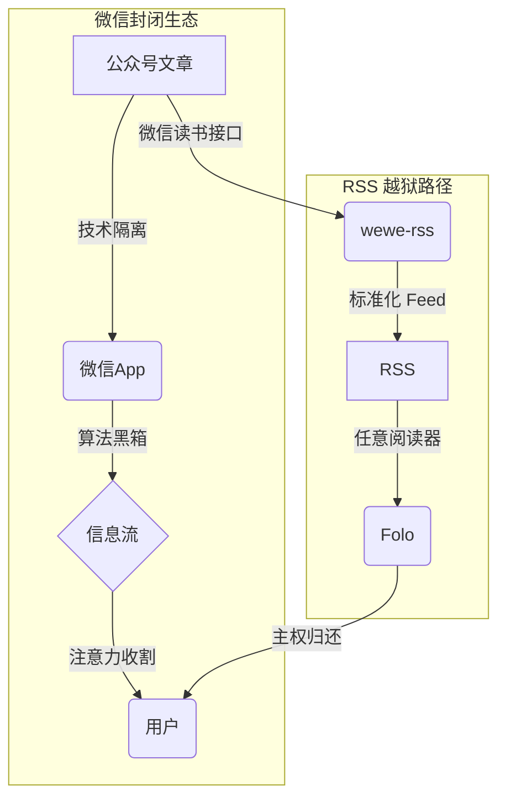

## 主权失窃

RSS 已死。  
不是协议层面的消亡，而是权力层面的溃败——用户交出了选择看什么、何时看的绝对主权。

微信公众号完成了这场政变。它用两层锁链重新编码信息：

1. **技术锁**：内容囚禁于微信 App，无 API，无 RSS，无逃逸路径
2. **算法锁**：即使关注，也按商业最优解而非信息价值排序

结果是**注意力农奴制**——你以为在浏览，实则在犁地。

.491kn3k47y.png>)

## 系统解剖

**技术隔离层**  
无 RSS，无 API，无网页版。内容被封装在微信的私有格式中，如同被锁进 DRM 的电子书。

**算法黑箱层**  
即使关注，算法也会根据停留时长、广告转化率等指标重新排序。你的每一次点击都在训练这个黑箱更精准地收割你。

.60uji03h4a.png>)

## 穿孔方案

`wewe-rss` 不攻击系统，它**利用**系统。  
通过调用微信读书的同步接口，将公众号内容转化为标准 RSS。这不是破解，是**协议嫁接**：

- **接口合法性**：使用微信读书官方 API
- **格式标准化**：输出 RSS 2.0，解锁任意阅读器
- **延迟容忍**：15-30 分钟延迟，换取稳定性

局限？当然有。付费内容无法获取，接口随时可能关闭。但这是**可接受的脆弱性**——在绝对控制与绝对自由之间，这是唯一可行的中间态。

.5q7pouo8yv.png>)

## 现代终端

`wewe-rss` 解决源的问题，`Folo` 解决端的问题。  
它保留了 RSS 的核心精神（用户主权），同时注入了现代产品的必要特性：

- **跨端同步**：阅读进度、收藏、高亮实时同步
- **AI 辅助**：摘要与翻译，但**决策权在用户**
- **社区发现**：通过用户创建的列表发现新源

| 维度       | 微信公众号 | wewe-rss + Folo |
| :--------- | :--------- | :-------------- |
| 阅读环境   | 干扰轰炸   | 纯净专注        |
| 内容排序   | 黑箱算法   | 时间顺序        |
| 数据所有权 | 平台所有   | 用户可导出      |
| 开放性     | 封闭监狱   | 开放协议        |

.7p3wf6trab.png>)

## 脆弱的自由

这套方案能持续多久？  
取决于微信读书的接口政策，可能明天就失效。

但它证明了：**中心化平台的控制力并非绝对**。通过技术工具，个人可以部分夺回信息主权。这不是胜利，是**抵抗**。

RSS 这个 1999 年的协议，在 2025 年反而成为对抗平台中心化的最有效工具。它提醒我们：**开放协议比封闭平台活得更久**。

## 行动清单

1. **盘点**：列出你真正需要关注的公众号
2. **转换**：用 `wewe-rss` 生成 RSS 地址
3. **阅读**：导入 `Folo` 或其他 RSS 阅读器
4. **习惯**：用主动阅读替代被动刷屏

夺回信息主权不是技术问题，是**习惯问题**。

