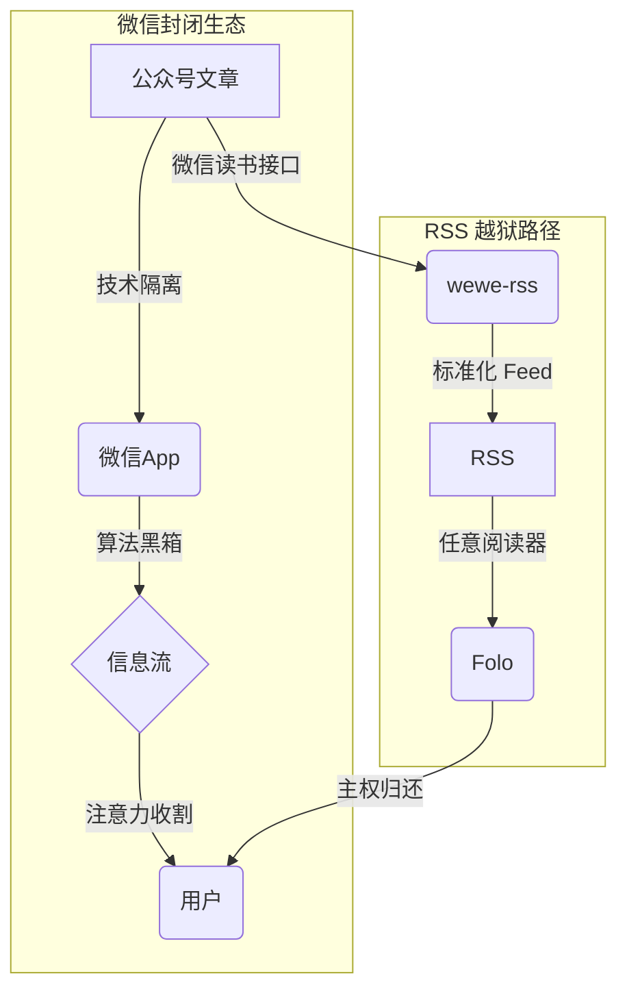

## 控制权旁落

RSS 并未消亡。

变化的不是协议，而是信息分发领域的权力结构。

用户在事实上让渡了选择看什么、何时看的权利。

微信公众号重塑了这种结构，通过两层约束：

1.  **技术约束**：内容被封装于 App 内，无标准 API，无 RSS 输出通道。
2.  **算法约束**：信息流按商业目标而非时间或信息价值排序。

其结果是一种**注意力被动引导机制**——用户的浏览行为，被用于优化平台的商业目标。

.491kn3k47y.png>)

## 系统解剖

**技术隔离层**

无 RSS，无 API，内容被封装在微信内。

**算法黑箱层**

算法根据用户停留时长、交互数据等指标对内容进行排序。用户的每一次点击，都在优化这个系统以更高效地实现其排序目标。

.60uji03h4a.png>)

## 穿孔方案

`wewe-rss` 不破坏系统，它**利用**其现有接口。  
通过调用微信读书的同步接口，将公众号内容转化为标准 RSS。这不是破解，是**协议嫁接**：

- **接口合法性**：使用微信读书官方 API。
- **格式标准化**：输出 RSS 2.0，兼容任意阅读器。
- **延迟容忍**：以 15-30 分钟的延迟，换取系统稳定性。

局限依然存在：付费墙内内容无法获取，接口也可能在未来关闭。但这是一种**可接受的脆弱性**——在绝对控制与完全开放之间，它提供了一个可行的中间路径。

.5q7pouo8yv.png>)

## 现代终端

`wewe-rss` 解决“源”的问题，`Folo` 解决“端”的问题。  
它保留了 RSS 的核心价值（用户控制权），并集成了现代产品的必要特性：

- **跨端同步**：阅读进度、收藏、高亮等状态的实时同步。
- **AI 辅助**：提供摘要与翻译，但决策权保留给用户。
- **社区发现**：通过用户创建的订阅列表发现新信源。

| 维度       | 微信公众号 | wewe-rss + Folo |
| :--------- | :--------- | :-------------- |
| 阅读环境   | 高密度干扰 | 纯净专注        |
| 内容排序   | 黑箱算法   | 时间或自定义    |
| 数据所有权 | 平台持有   | 用户可导出      |
| 开放性     | 封闭系统   | 开放协议        |

.7p3wf6trab.png>)

## 脆弱的平衡

这套方案的生命周期，取决于微信读书的接口策略，存在不确定性。

但它证明了：**中心化平台的控制并非绝对**。

通过技术工具，个体可以重新取回部分信息控制权。

这不是颠覆，而是一种**结构性再平衡**。

RSS 这个 1999 年的协议，在 2025 年成为制衡平台中心化的有效工具。

这提示我们：**开放协议通常比封闭应用拥有更长的生命周期**。

## 行动清单

1.  **盘点**：识别你真正需要关注的信源。
2.  **转换**：使用 `wewe-rss` 生成 RSS 地址。
3.  **阅读**：导入 `Folo` 或你选择的 RSS 阅读器。
4.  **重塑**：用主动拉取替代被动投喂的阅读习惯。

信息控制权的回归，是使用习惯的重塑。

