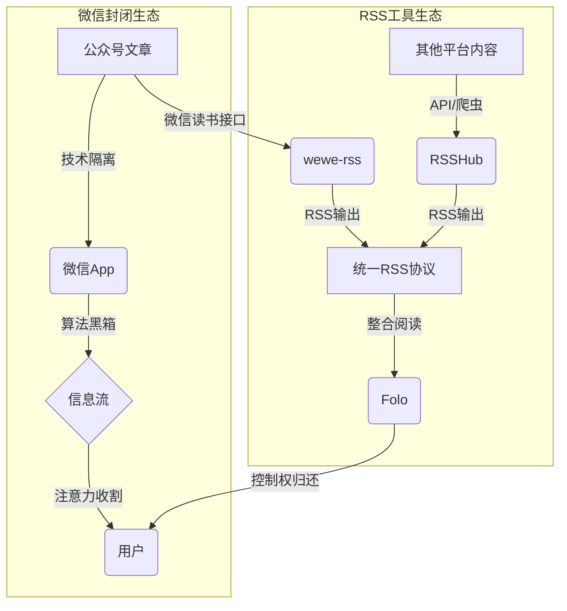

## 控制权旁落

RSS 并未消亡。

变化的不是协议，而是信息分发领域的权力结构。

用户在事实上让渡了选择看什么、何时看的权利。

微信公众号重塑了这种结构，通过两层约束：

1.  **技术约束**：内容被封装于 App 内，无标准 API，无 RSS 输出通道。
2.  **算法约束**：信息流按商业目标而非时间或信息价值排序。

其结果是一种**注意力被动引导机制**——用户的浏览行为，被用于优化平台的商业目标。

.491kn3k47y.png>)

## 系统解剖

**技术隔离层**

无 RSS，无 API，内容被封装在微信内。

**算法黑箱层**

算法根据用户停留时长、交互数据等指标对内容进行排序。用户的每一次点击，都在优化这个系统以更高效地实现其排序目标。

.60uji03h4a.png>)

## 穿孔方案

面对技术和算法的双重约束，开源社区提供了协同的解决工具：

### 微信公众号的专用工具：wewe-rss

`wewe-rss` 专门针对微信公众号这一特殊封闭系统。它不破坏系统，而是**利用**其现有接口。

通过调用微信读书的同步接口，将公众号内容转化为标准 RSS。这不是破解，是**协议嫁接**：

- **接口合法性**：使用微信读书官方 API
- **格式标准化**：输出 RSS 2.0，兼容任意阅读器
- **延迟容忍**：以 15-30 分钟的延迟，换取系统稳定性

### 多平台的通用工具：RSSHub

`RSSHub` 覆盖微信之外的广阔信息源——微博、Twitter、知乎、GitHub 等 1000+平台。它采用企业级架构：

- **多源适配**：每个平台都有专门的适配器
- **反爬虫技术**：浏览器自动化、代理轮换、签名验证
- **社区驱动**：标准化的贡献流程和质量保证体系

### 工具生态的协同价值

这两个工具在实际使用中形成**互补覆盖**：

- **wewe-rss** 处理微信公众号这一中文互联网重要信息源
- **RSSHub** 覆盖其他所有主流平台和网站
- **Folo** 作为统一终端，整合所有 RSS 源的阅读体验

它们共同指向同一目标：**将分散的封闭内容重新导入开放协议**。

局限依然存在：付费墙内容无法获取，接口可能关闭。但这是一种**可接受的脆弱性**——在绝对控制与完全开放之间，这个工具生态提供了可行的中间路径。

.5q7pouo8yv.png>)

## 脆弱的平衡

这套方案的生命周期，取决于微信读书的接口策略，存在不确定性。

但它证明了：**中心化平台的控制并非绝对**。

通过技术工具，个体可以重新取回部分信息控制权。

这不是颠覆，而是一种**结构性再平衡**。

RSS 这个 1999 年的协议，在 2025 年成为制衡平台中心化的有效工具。

这提示我们：**开放协议通常比封闭应用拥有更长的生命周期**。当用户需求与平台利益发生冲突时，基于开放标准的工具生态会自发涌现出解决方案。

.7p3wf6trab.png>)

## 行动清单

1.  **盘点**：识别你真正需要关注的信源。
2.  **部署**：搭建`wewe-rss`处理微信公众号，部署`RSSHub`覆盖其他平台。
3.  **整合**：将所有 RSS 源导入`Folo`或你选择的 RSS 阅读器。
4.  **重塑**：用主动拉取替代被动投喂的阅读习惯。

信息控制权的回归，是使用习惯的重塑。

