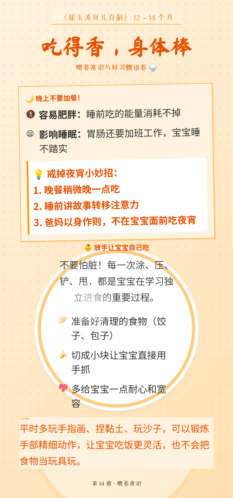

家里那本《崔玉涛育儿百科》，**700 多页**，厚得像块砖。

不是不想看——是真的没时间。但眼看宝宝马上满周岁了，第 14 章「12-14 个月幼儿」的内容马上就要用上了。什么疫苗要打、吃什么辅食、怎么引导走路……这些知识点散落在几十页密密麻麻的文字里，每次翻书都要重新定位。

我想：能不能把这些精华提取出来，做成那种「一图读懂」的海报？这样需要的时候直接翻手机相册就行。

问题是——我**不会设计**。不过，我有 **Claude**。

<!-- more -->

我决定试试能不能让 AI 帮我做这件事。

**目标很简单**：把《育儿百科》第 14 章的内容，变成 8 张可以发朋友圈的精美海报。听起来像是需要设计师 + 排版师 + 内容编辑的活儿，但也许 AI 能搞定？

## 第一步：让 AI「读」书

这一章有几十页。如果让我把文字一个个敲出来喂给 AI，那我不如直接自己看了。

有没有更省事的办法？

好在 **Claude** 已经支持 `PDF` 处理了。我直接把整本书的 `PDF` 文件扔过去，让它自己提取第 14 章的内容。

Claude 调用了它的 `document-skills:pdf` 技能，把 `PDF` 转成图片，然后用多模态能力一页一页"看"——在我这次体验里，比我以前折腾 `OCR` 省事一些，因为它不只是识别文字，还能把排版结构（比如标题层级、段落、表格）一起读出来，后续整理时**返工更少**。

## 第二步：用代码「设计」海报

内容有了，接下来是设计。

我跟 Claude 说：「我想要一套育儿风格的海报。背景要温馨，字体要可爱，重点要突出。」

Claude 没有直接给我画图（它目前还不支持直接生成图片），但它做了一件更符合程序员思维的事——它写了一个 `HTML` 页面，用 `CSS` 排版生成了一个网页版的海报。

这个思路很有意思：我会把它理解成——设计工具把这些视觉参数（颜色、字体、间距、布局）做成了可视化界面，而 `HTML/CSS` 则把同一套参数写成代码。对我这种更习惯“改文本 → 看效果”的人来说，反而更顺手。

第一版生成的海报有点简陋——纯白背景 + 黑色文字。

我说：「太素了，加点颜色，标题换个可爱的字体。」

Claude 改了几行 CSS，海报立刻变了样。粉色渐变背景，标题也换成了更像手写的字体。

我说：「这个排版太挤了，改成左右分栏，加点图标装饰。」

它又迭代了一版——左边是重点摘要，右边是详细说明，表情符号（emoji）点缀在关键信息旁边。

这个循环工作流很顺畅：我负责提需求和审美判断，它负责把我的模糊描述转化成精确的代码实现。我不需要学 `CSS`，也不需要打开 `Photoshop`，只需要用自然语言说「我想要什么效果」，它就能翻译成代码。

不过再想一下，这种协作方式似乎暴露了一个有趣的分工模式：人类擅长的是「模糊的审美判断」和「高层次的意图表达」，AI 擅长的是「精确的参数调整」和「快速的迭代执行」。两者结合，效率比单独工作高得多。

## 第三步：从 HTML 到 PNG

整个过程大概花了半个下午。

坦白说，AI 不是完美的。有时候它会卡住不动，我问一句 `stuck?`，它才继续。有时候生成的 `CSS` 样式在移动端显示不正常，我得提醒它检查视口（`viewport`）设置。有时候它会忘记我之前说过的某个设计要求，我得重申一遍。

这种体验很像是在带一个刚毕业的实习生工作：它很聪明，学东西飞快，执行力也强，但需要你时不时地提醒、纠偏、补充上下文。你不能扔一个任务就不管了，而是需要保持对话，持续检查（`review`）它的输出，给出反馈。
最后一步是把 `HTML` 转成 `PNG` 图片。我让 Claude 写了个 `Python` 脚本，用 `Playwright` 渲染 `HTML` 然后截图。这里有个小技巧：海报的高度是动态的（内容多少不一样），使用了 `bounding_box()` 方法获取实际渲染高度，而不是写死一个固定值，这样避免了长海报被截断的问题。

```python
# src/html_to_png.py

# 获取海报容器的实际尺寸
poster_element = page.locator('.poster-container')
box = await poster_element.bounding_box()

# 动态调整视口大小以适应内容高度
# 注意：box['height'] 是浮点数，set_viewport_size 需要整数
# device_scale_factor=1 确保了像素点 1:1 映射，避免了高 DPI 下的模糊
if box:
    await page.set_viewport_size({"width": 2160, "height": int(box['height'])})
```
这个细节花了不少时间调试——一开始用固定高度 3840px，结果有些海报内容超出被截断了，后来才改成动态检测。AI 生成了基础代码框架，但这种边界情况的调试（`debug`）往往需要人类的介入或者多轮对话的打磨。

## 成果展示

最后，我们（我和这位 **AI** 实习生）搞定了 **8 张海报**。

涵盖了 12-14 个月宝宝的发育指标、体检指南、喂养常识、早教建议等等。

来看看成品：

**宝宝发育里程碑：**


**喂养常识：**


**体检指南：**


我说：「是我和一个 AI 一起做的。」

## 三点感悟

做完这 8 张海报后，我有了一些关于 AI 协作的思考。

### 1. AI 是能力放大器，但也是认知放大器

我有想法（做海报），但缺技能（设计 + 排版 + 代码实现）。以前，这个想法只能烂在肚子里，或者花几千块外包给设计师。

现在，AI 似乎填补了「想法」和「成品」之间的技能鸿沟。但它不只是放大了我的执行能力，也放大了我的认知能力——在和 Claude 对话的过程中，我对「什么是好的设计」有了更清晰的理解。

当你不得不用语言精确地描述你想要的效果时（「粉色渐变，不要太浓」「字体要可爱但不能太卡通」「留白要多但不能显得空」），你会发现自己对审美的理解变得更具体了。这种「被迫清晰化需求」的过程，本身就是一种学习。

### 2. 不过再想一下...人机协作的本质是什么？

它更像是一种认知外包。

在这个下午，我做的事情主要是：
- **需求定义**：我想要什么效果？
- **审美判断**：这个版本好不好？
- **方向纠偏**：这里改一下会不会更好？
- **边界处理**：这个边界情况（`edge case`）怎么处理？

而 AI 做的是：
- **技术实现**：把需求转化成代码
- **快速迭代**：改 CSS、调布局、换字体
- **细节填充**：表情符号（emoji）、颜色配色、间距调整

两者的分工很清晰，但这也意味着：如果我没有能力做好「需求定义」和「审美判断」，AI 再强也帮不了我。它不会替我决定「我想做什么」，只会帮我实现「我已经想好的东西」。

那些说「AI 会取代设计师」的观点，可能忽略了一个关键点：设计师的核心价值不是「会用 Photoshop」，而是「知道什么样的设计能解决什么问题」。前者是技能，后者是认知。AI 可以替代技能，但暂时还替代不了认知。

不过，话说回来——会不会有一天，AI 也能替代认知？它会不会比我更懂「什么样的海报适合这个受众」？这是个开放性问题。

### 3. 未来的工作方式会变成什么样？

既然 AI 能帮我读育儿书做海报，那它能不能帮我读财报做分析？能不能帮我读论文写综述？能不能帮我读代码写文档？

答案似乎都是肯定的。

那这意味着什么？

也许未来的工作会越来越变成一种「认知管理」的游戏：你需要管理的不是你的双手（做事的速度），而是你的大脑（判断的质量）。你的竞争力不再是「我能做什么」，而是「我知道该做什么」。

从这个角度看，AI 时代最稀缺的能力可能是：
- **提出好问题的能力**（而不是找到答案）
- **做出审美判断的能力**（而不是执行设计）
- **定义清晰需求的能力**（而不是实现需求）

这些都是很难被自动化的「元认知」能力。

---

这就引出了一个有趣的问题：

> **如果你拥有了一个随叫随到、能力全面的 AI 助手，你最想让它帮你做什么？**

或者换个角度问：

> **你现在有什么想法，一直想做但觉得自己「技能点」不够？**

也许，是时候试试看了。
